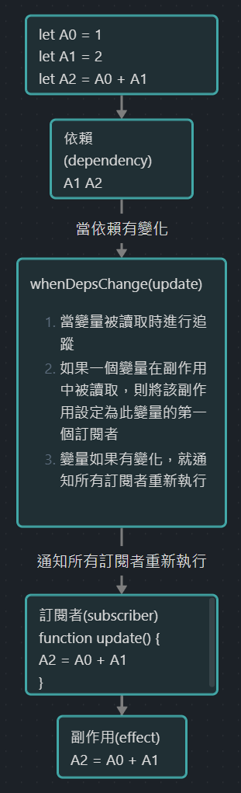

> 響應式的對象其實是 [Proxy](https://developer.mozilla.org/zh-CN/docs/Web/JavaScript/Reference/Global_Objects/Proxy)

```javascript
let A0 = 1
let A1 = 2
let A2 = A0 + A1

console.log(A2) // 3

A0 = 2
console.log(A2) // 仍然是 3
```

一般來說當 `A0` 改變時 `A2` 不會響應式變化，透過下列方法實現響應式



> 當依賴有變化，就會調用所有的訂閱者，訂閱者執行後就會產生副作用，進而影響依賴